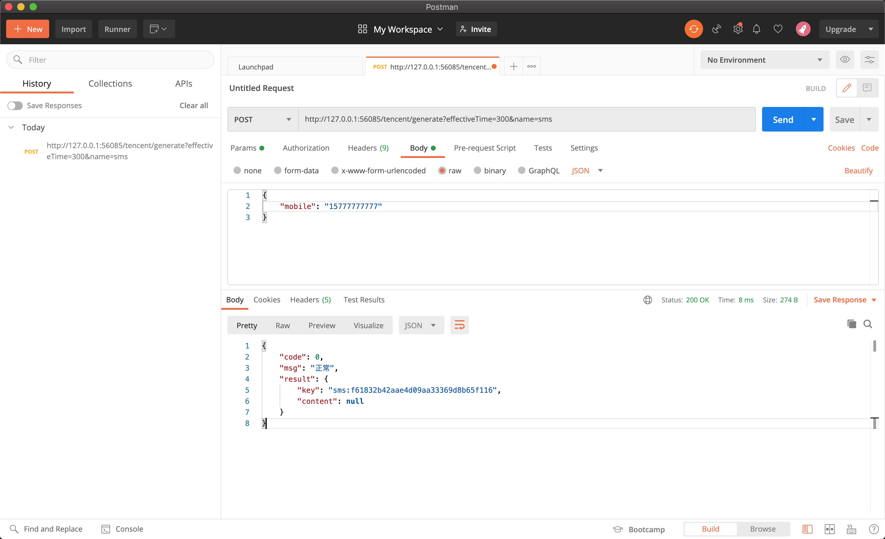
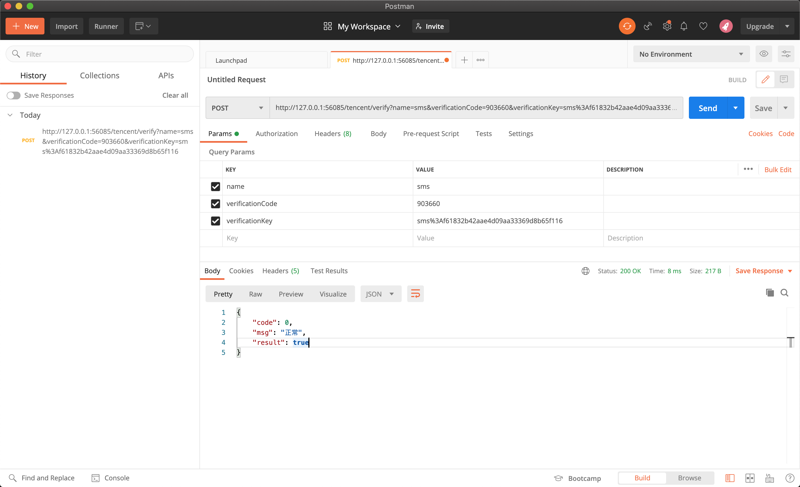

# tencent-sms(腾讯云短信服务)

[](https://github.com/mikuhuyo/tencent-sms/blob/master/LICENSE)
[](https://github.com/mikuhuyo/tencent-sms/issues)
[](https://github.com/mikuhuyo/tencent-sms/stargazers)
[](https://github.com/mikuhuyo/tencent-sms/network)


---

## 预备知识点

- Tencent短信服务
- Redis
- SpringBoot
- Swagger

## 本仓库

### 关注

[](https://github.com/mikuhuyo/tencent-sms/stargazers)

### 收藏

[](https://github.com/mikuhuyo/tencent-sms/network/members)

## 功能演示

### 获取短信



### 短信校验



## 项目启动

### 创建容器

```shell script
docker pull redis:4

docker run --name redis -p 6379:6379  \
-d redis:4 \
--requirepass "yueliminvc@outlook.com" \
--appendonly yes
```

### 修改配置

修改`sms`与`redis`配置.

```yaml`
sms:
  qcloud:
    appId: 12345678
    appKey: 'yueliminvc888888ddddd'
    templateId: '123456'
    sign: 'fake'
```

### 开启腾讯短信服务

修改`com.tencent.sms.SmsNumberVerificationHandler`(将`sms.service.send()`注释取消):

```java
@Override
String confusion(Map<String, Object> payload, String key, String code) {
    String mobile = String.valueOf(payload.get("mobile"));

    // 使用腾讯云发送短信
    smsService.send(mobile, code, getEffectiveTime());

    // 测试使用, 在控制台输出验证码
    smsService.sendOnConsole(mobile, code, getEffectiveTime());
    return null;
}
```
